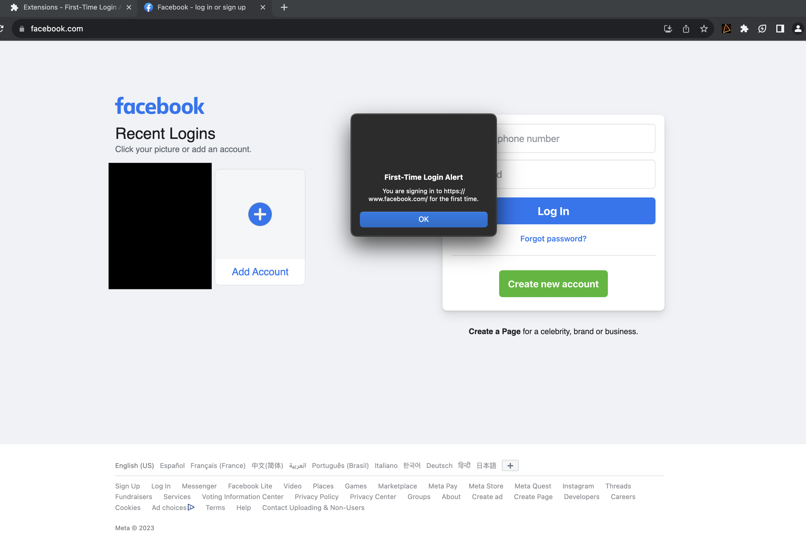

# LifeAlert
A Chrome extension that notifies if you are about to enter your login information onto a website for the first time.

This idea occurred to me as a way to prevent users to enter their credentials into cloned websites. A website might look exactly like your bank or facebook and you don't realize that there might be something different in the address bar but since you often visit your bank's website if you happen to be a site that looks like it but it not it will alert you with a pop up.

## Installation:

Load the extension into Chrome:
- Open Chrome and navigate to chrome://extensions/.
- Enable Developer mode (toggle switch in the top right corner).
- Click on "Load unpacked" and select the folder containing your extension files.

Now, whenever you visit a website with a login form, the extension will detect if you are signing in for the first time and show an alert.
